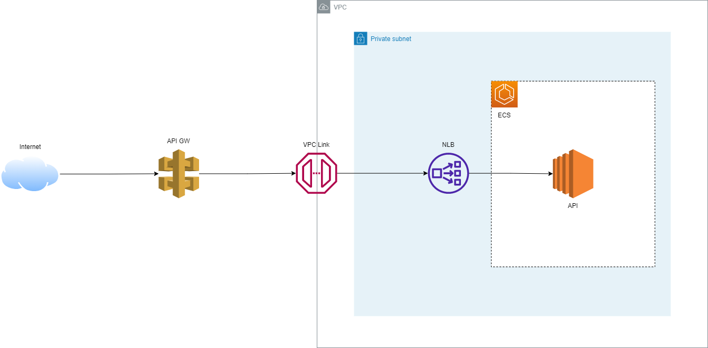

# API Gateway with VPC Link to expose internal services

The API Gateway uses a lambda authorizer to authorize requests to the services running on ECS.

The containers on ECS are reached through network balancer pointing to the EC2s, and a VPC link in front of the network balancer, then the API Gateway uses the VPC link integration.

> Architecture

## Docs

- [https://docs.aws.amazon.com/lambda/latest/dg/python-image.html](https://docs.aws.amazon.com/lambda/latest/dg/python-image.html)

- [https://registry.terraform.io/providers/hashicorp/aws/latest/docs/resources/api_gateway_authorizer](https://registry.terraform.io/providers/hashicorp/aws/latest/docs/resources/api_gateway_authorizer)

- [https://docs.aws.amazon.com/apigateway/latest/developerguide/apigateway-use-lambda-authorizer.html](https://docs.aws.amazon.com/apigateway/latest/developerguide/apigateway-use-lambda-authorizer.html)

- [https://docs.aws.amazon.com/apigateway/latest/developerguide/call-api-with-api-gateway-lambda-authorization.html](https://docs.aws.amazon.com/apigateway/latest/developerguide/call-api-with-api-gateway-lambda-authorization.html)

- [https://www.alexdebrie.com/posts/lambda-custom-authorizers/#full-authorization](https://www.alexdebrie.com/posts/lambda-custom-authorizers/#full-authorization)
