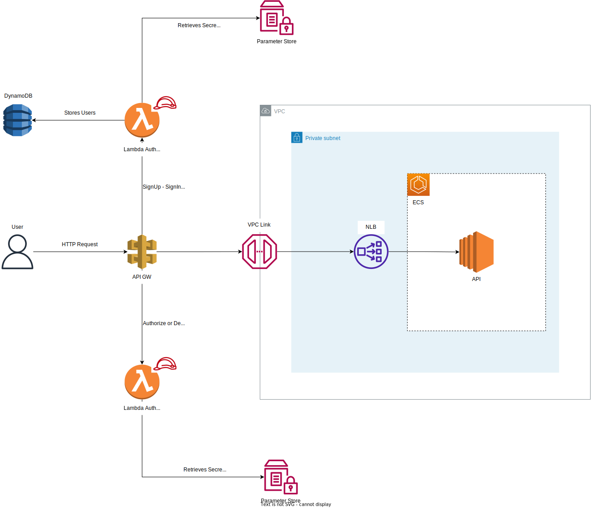

# API Gateway with VPC Link to expose internal services, using Lambda Authorizer

The API Gateway uses a Lambda Authorizer to authorize requests to the services running on ECS, there is also another Lambda responsible for signing up and signing in users, generating and JWT token to be used then with the Lambda Authorizer.

The containers on ECS are reached through a network load balancer pointing to the EC2s, and there is VPC Link in front of the network balancer, then the API Gateway uses the HTTP Proxy with VPC Link integration to reach protected endpoints on ECS and Lambda with Proxy integration to reach authentication endpoints.

> Architecture

> Auth Flow

## Deploy

Instructions for deploy here: [Instructions](./infrastructure/README.md)

## APIs Usage

Instructions here: [Instructions](./docs/USAGE.md)
